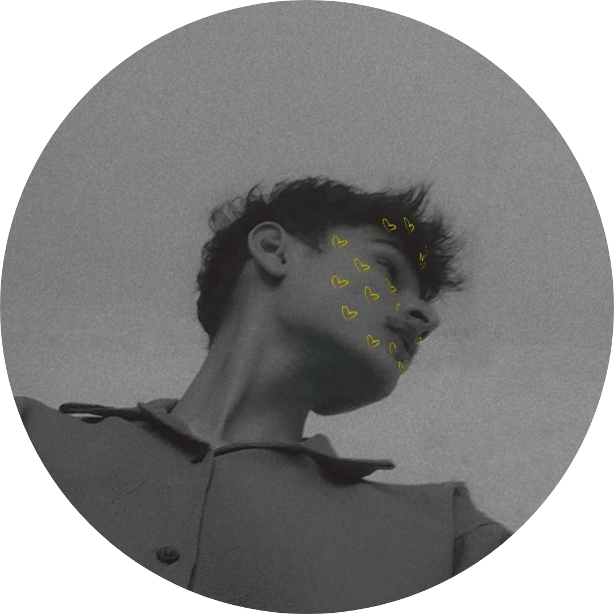
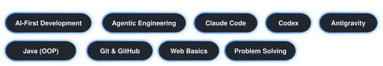

 

---

# 🧠 About Me

| | | |
|:--|:--|:--|
|  | **CSE** Computer Science Engineering | Noble University |
|  | **UI/UX** Front end design | Tech rover solutions |

I enjoy building **clean, scalable, and meaningful digital products**.  
My focus is on **Full Stack Development, AI integrations, and product-driven engineering**.

# 🛠 Tech Stack

---

# 📊 GitHub Stats

---

# 🌐 Connect With Me

---

<i>"Build what you can't stop thinking about."</i>

